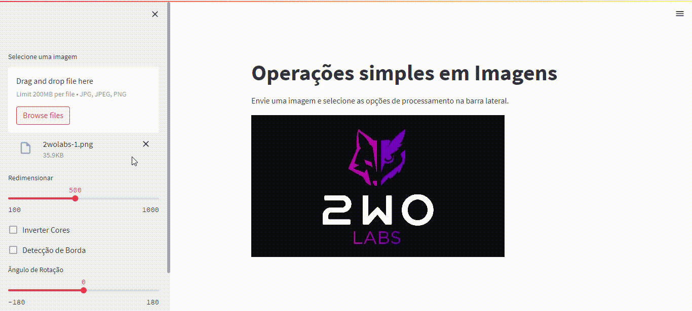

# Mini Processador de Imagens

Projeto destinado aos alunos de primeiro périodo ou iniciantes em python.

O projeto foi desenvolvido para apresentar: python e processamento de imagem. Sistema de processamento de imagem simples.

## Descrição do Projeto
O propósito do projeto é mostrar algumas téncnicas de processamento de imagem usando Python e montar uma interface enxuta com Streamlit

## Como Executar

1. Certifique-se de ter o Python 3.7 ou superior instalado.

2. Clone o repositório para o seu ambiente local.
```
git clone git@github.com:2wo-Labs/mini-processador-de-imagem.git
```

3. Instale as dependências usando o comando:
```
pip install -r requirements.txt
```

4. Execute o aplicativo utilizando o comando:
```
streamlit run app.py
```

5. O aplicativo será aberto em seu navegador padrão. Você pode interagir com as diferentes funcionalidades do sistema.


## Funcionalidades

- Enviar imagem

- Redimensionar

- Inverter cores

- Detecção de borda

- Rotação

- Inversão Horizontal

- Inversão Vertical


## Screenshots (GIF)

****



O GIF mostra como funcionam as funcionalidades do sistema.


## Dependências

O sistema depende das seguintes bibliotecas Python:

- streamlit
- Pillow

## Contribuição

Contribuições são bem-vindas! Sinta-se à vontade para abrir uma issue ou enviar um pull request com melhorias ou correções.

## Licença

Este projeto está licenciado sob a [MIT License](LICENSE).
